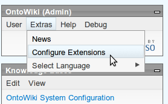
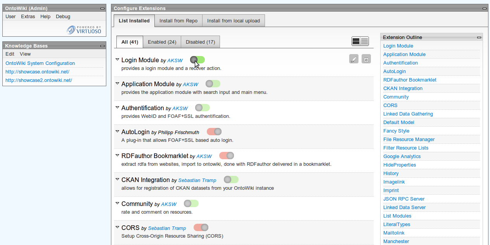
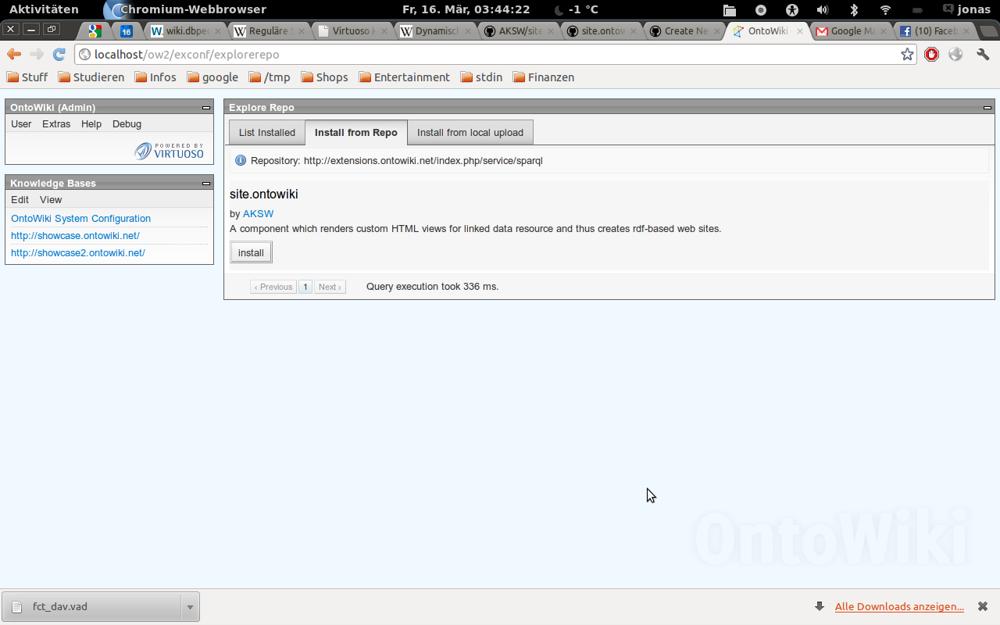

In OntoWiki 0.9.6 we introduced a graphical backend to configure extensions. The site admin can enable and disable extensions, set configuration values and browse a central repository of additional extensions and install them into his OntoWiki instance.

When you are logged in as Admin or SuperAdmin, you will notice the "Configure Extensions" menu item in the Extras menu:

Alternatively you can open http://your-ontowiki/exconf
you will see a overview of which extension are installed and which are activated:

by clicking on the name or the edit button, you will see the detailed config of that extension:

you can changes values here. If you do so, a special file will be created in the extension folder named "<extenion-name>.ini" also called local ini. This file is a copy of the default.ini (which should not be changed) and overwrite these settings. That means your local config is independent from the (versioned) default.ini. A current limitation is that is you delete a config key in your local config, the value from the default config is still present and thus sets the value to its default value. You can also change the structure of the config (which is usefull for example in the navigation config), but if the extension does not expect to a (partly) arbitrary config, you will get unexpected behaviour.

If you click the "Explore Repo" tab, you will see a list of extensions present in our repository at http://extensions.ontowiki.net. Read more about [here](Extension-Repository).

