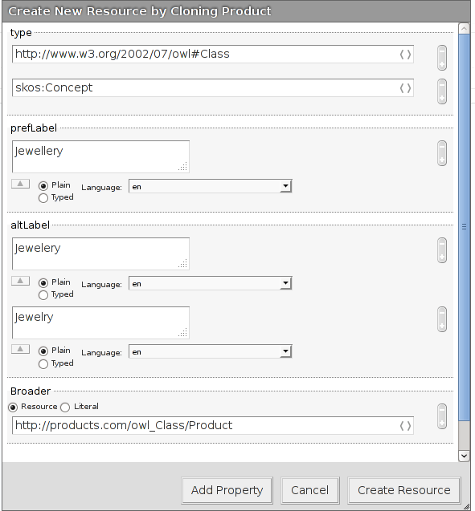

## The example taxonomy

    @prefix rdf: <http://www.w3.org/1999/02/22-rdf-syntax-ns#> .
    @prefix skos: <http://www.w3.org/2004/02/skos/core#> .
    @prefix ex: <http://www.products.com/>.
    @prefix owl: <http://www.w3.org/2002/07/owl#>.

    ex:Product rdf:type owl:Class;
      a skos:Concept;
      skos:prefLabel "Product"@en;

    ex:Jewellery rdf:type owl:Class;
      a skos:Concept;
      skos:prefLabel "Jewellery"@en;
      skos:altLabel "Jewelry"@en;
      skos:altLabel "Jewelery"@en;
      skos:broader ex:Product.                                                  

## Create the knowledge base
- Open OntoWiki and log in as "Admin" or some other user that can create knowledge bases.
- Go to **Knowledge Bases**->**Edit**->**Create Knowledge Base**.
- Set the **Knowledge Base URI** to `http://www.products.com/`.

Now you have several options:
### Add classes and properties using dialogs
- Select **Create Empty Knowledge Base** and click on **Create Knowledge Base**.
- Go to **Navigation: Classes**->**Edit**->**Add resource here**.
- Click on **Add Property** and choose **rdf:Type**. Type `skos:Concept` in the text box.
- Click on **Add Property** and choose **preferred label**. Type `Product` in the text box and choose `en` as a language. Click on **CreateResource**.

- On the right you should see the window "Properties of Product". Click on **Clone** in the **Properties** tab. Replace the values of the preferedLabel with `Jewellery`.
- Click on **Add Property**, type `skos:altLabel` in the text field and hit enter. Type `Jewelery` in the text box and choose `en` as a language.
- Click on the plus symbol **+** of the alternative label, type `Jewelry` in the text box and choose `en` as a language.
- Click on **Add Property** and type `skos:broader`. Select **Resource** and type `http://www.products.com/owl_Class/Product` in the text field. Click on **Create Resource**.

### Upload a file
- Copy the example taxonomy and save it as a file named `example.n3`.
- Select **Upload a File**, File Type **Autodetect** and browse for the file `example.n3`.
- Click on **Create Knowledge Base** and then **Save Model Configuration**.

### Paste source
- Select **Paste Source**.
- Select Format **n3**, copy the example taxonomy and paste it into the text box..
- Click on **Create Knowledge Base** and then **Save Model Configuration**.