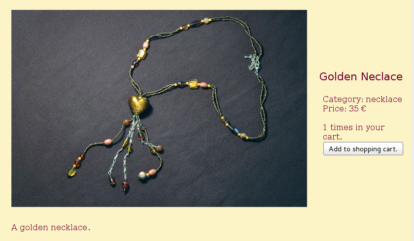
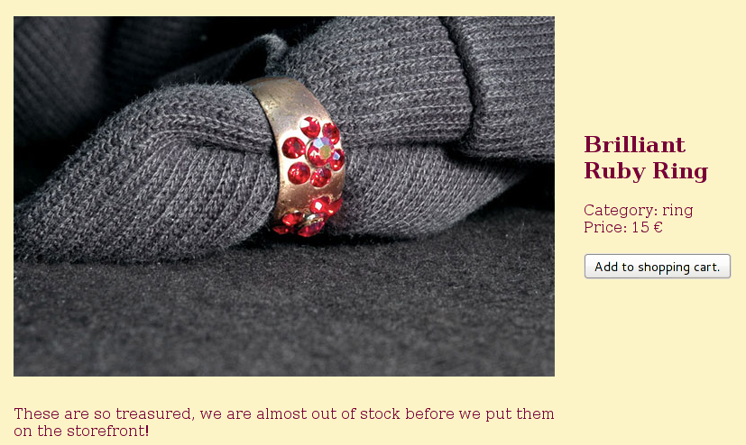

## Under construction

## Assumptions
We assume that your company has a set of products for which information is available in some structured form, but not as Linked Data (if it is, follow [How to use and consume other Linked Data resources](How-to-use-and-consume-other-Linked-Data-resources) instead).

## Good Relations Vocabulary
We will use [Good Relations](http://www.heppnetz.de/projects/goodrelations/) which is a popular E-Commerce vocabulary that is respected by Google and Yahoo, among others. Enriching your product data with RDF-a is a means of Semantic SEO and increases your search engine ratings and preview information.

To use Good Relations, create a new Knowledge Base 

## Modelling your Product Data with an Example
For simplicity we show the modelling with just two examplary products:

These products share a common set of attributes:
- Name
- Category
- Description
- Price

## From a Database

publish as rdfa